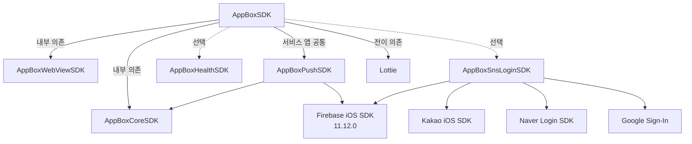

# AppBox SDK (iOS)

[](https://swift.org/package-manager/)
[](https://github.com/MobilePartnersCo/AppBoxSampleiOS)

- AppBox SDK는 모바일 웹사이트를 앱으로 패키징하여 최소한의 개발로 App Store에 등록할 수 있는 솔루션입니다.
- 모바일 웹사이트에서 JavaScript 코드를 사용해 앱의 기능을 사용할 수 있으며, 약 40+ 기능을 무료로 제공합니다.
- SDK 형태로 제공되며, 도메인(또는 Base URL)만 입력하면 기본 브라우저 기능부터 간편히 사용 가능합니다.

---

## AppBox SDK 사용 샘플소스

- iOS 샘플 앱: https://github.com/MobilePartnersCo/AppBoxSampleiOS

---

## 라이선스

- AppBox SDK의 사용은 영구적으로 무료입니다. 기업 또는 개인 상업적인 목적으로 사용 할 수 있습니다.

---

## 개발자 메뉴얼

- 메뉴얼: https://console.appboxapp.com/guide/appbox/%EC%B4%88%EA%B8%B0%20%EC%84%A4%EC%A0%95

---

## 데모앱 다운로드

- GooglePlay: https://play.google.com/store/apps/details?id=kr.co.mobpa.appbox
- AppStore: https://apps.apple.com/kr/app/id6737824370

---

## 5분 Quick Start: Base + Push

AppBoxSDK 기반 서비스 앱은 Push를 공통으로 포함합니다. 앱 target에 `AppBoxSDK`와 `AppBoxPushSDK`를 연결하고, 초기화는 `AppBox` 정적 Facade 한 곳에서 수행합니다. 정적 Facade는 별도 인스턴스를 만들지 않고 `AppBox.initialize(...)`, `AppBox.start(from:)`처럼 `AppBox` 타입에서 기능을 바로 호출하는 사용 방식입니다.

이 저장소의 실행 target은 Push, SNS Login, Health를 모두 연결한 전체 기능 확인용 샘플입니다. 아래 코드는 처음 적용할 때 복사할 Base + Push 기본 예제이며, 선택 기능은 뒤의 목적별 구성 예제에서 추가합니다.

```swift
import UIKit
import UserNotifications
import AppBoxSDK

@main
final class AppDelegate: UIResponder, UIApplicationDelegate {
  func application(_ application: UIApplication,
                   didFinishLaunchingWithOptions launchOptions: [UIApplication.LaunchOptionsKey: Any]?) -> Bool {
    // [필수] AppBoxSDK 서비스 앱은 Push config를 공통으로 포함합니다.
    // Base + Push만 사용할 때 firebaseClientID는 필요하지 않습니다.
    let config = AppBoxInitConfig(
      common: AppBoxCommonConfig(
        projectId: "YOUR_PROJECT_ID",
        debugMode: false
      ),
      webView: AppBoxWebViewInitConfig(
        baseURL: "https://www.example.com"
      ),
      push: AppBoxPushInitConfig()
    )

    AppBox.initialize(config) { result in
      // [주의] Push 모듈 초기화가 완료된 뒤 권한 요청과 APNs 등록을 시작합니다.
      guard result.push.status == .INITIALIZED else {
        print("Push 초기화 실패: \(result.push.message)")
        return
      }
      AppBox.requestPushAuthorization { granted, error in
        if let error {
          print("Push 권한 요청 실패: \(error.localizedDescription)")
          return
        }
        guard granted else {
          print("사용자가 Push 권한을 허용하지 않았습니다.")
          return
        }
        _ = AppBox.registerForRemoteNotifications()
      }
    }

    return true
  }

  // [필수: Push] APNs deviceToken을 전달해야 AppBox Push token과 기기가 매핑됩니다.
  func application(_ application: UIApplication,
                   didRegisterForRemoteNotificationsWithDeviceToken deviceToken: Data) {
    _ = AppBox.handleAPNSToken(deviceToken)
  }
}
```

초기화 결과의 `status`가 `.INITIALIZED`이면 해당 기능을 사용할 수 있습니다. `.SKIPPED`는 설정하지 않았거나 현재 앱에 해당 Product가 연결되지 않은 상태이고, `.FAILED`는 초기화 실패입니다. 실패 원인은 각 결과의 `message`에서 확인합니다.

`AppBoxPushInitConfig()`는 Push 기능을 요청하는 config입니다. `firebaseClientID` 문자열은 Push 자체의 필수값이 아닙니다. Google 로그인을 활성화할 때만 로그인 구성의 Push config에 Firebase OAuth Client ID를 전달합니다. 알림 클릭, foreground 수신, background/silent payload callback까지 포함한 전체 코드는 아래 `1) AppBox 기본 WebView 사용` 예제를 함께 적용합니다.

---

## 최신 업데이트 (v1.2.20, 2026.07.20)

- AppBoxSDK 기반 서비스 앱의 진입점을 `AppBox.initialize(...)`와 `AppBox.*` 정적 Facade로 통일했습니다.
- Push는 모든 AppBoxSDK 서비스 앱에서 공통으로 연결하고, SNS Login과 Health Product는 필요한 기능에 따라 추가합니다.
- Push 권한 요청과 APNs 등록을 초기화 결과 이후에 앱이 명시적으로 시작하도록 lifecycle 예제를 갱신했습니다.
- Notification Service Extension과 AppBoxSDK가 없는 Push-only 앱은 기존 `AppBoxPush.shared` API를 유지합니다.
- Swift와 Objective-C 샘플, URL/Universal Link 및 AppsFlyer 예제를 정적 Facade 기준으로 정리했습니다.

<details>
<summary>이전 업데이트 내역</summary>

### v1.2.14 (2026.05.15)

- AppsFlyer Deep Link payload를 AppBox 웹 SDK ready 이후에만 JavaScript로 전달하도록 보강했습니다.
- WebView navigation 시작 시 deep link JS bridge ready 상태를 초기화해 이전 페이지 상태가 새 페이지 전달에 섞이지 않도록 했습니다.
- `inapp.ready` 수신 경로를 기준으로 pending delivery를 flush하도록 정리했습니다.
- `window.AppboxSDK.isReady === true` 확인 후 `window.AppboxSDK.deepLink.onReceive(payload)`를 호출합니다.
- SwiftUI 앱 사용자는 배포 레포의 SwiftUI 연동 가이드를 확인하도록 README 안내를 추가했습니다.
- Breaking change, public API 변경, 외부 의존성 변경은 없습니다.

### v1.2.10 (2026.05.15)

- `AppBox.shared.handleURL(_:options:)` API를 추가해 URL callback의 source application/options 정보를 SDK 라우팅에 전달합니다.
- SNS 로그인 URL은 `AppBoxSnsLoginSDK`로 우선 라우팅하고, AppsFlyer는 `scheme://open` 형태의 URI Scheme 딥링크만 처리하도록 제한했습니다.
- SceneDelegate 예제도 URLContext options를 AppDelegate openURL options 형태로 변환해 전달하도록 업데이트했습니다.
- v1.2.9 변경 포함: AppsFlyer Deep Link JS bridge, landscape 대응, 스캐너 portrait 고정, PDF/Image viewer 회전 레이아웃 개선.

### v1.2.9 (2026.05.15)

- AppsFlyer UDL result를 `window.AppboxSDK.deepLink.onReceive(payload)`로 전달하는 JS bridge 추가
- WebView 준비 전 수신된 딥링크 pending queue 보관 및 준비 후 flush 처리
- 동일 딥링크 중복 delivery 방지
- JS payload 계약 정리: `deep_link_value`, `subParam`, rawParams 제외
- iPhone/iPad portrait + landscape 허용 정책 및 주요 SDK 화면 회전 레이아웃 대응
- QR/Barcode 스캐너는 브릿지로 띄운 카메라 화면만 portrait 고정
- 구형 인앱 오픈 액션 제거 및 Health bridge 시그니처 정리
- WhiteLabel config의 top-level `"landscape": "Y" | "N"` 정책 반영

### v1.2.8 (2026.05.12)

- `gmenu.openHamburgerMenu`로 열린 햄버거 메뉴의 메뉴/프로필 action 실행 문제 수정
- 햄버거 메뉴 닫기 시 child view controller와 view hierarchy 정리 보강
- v1.2.7 변경 포함: AppsFlyer UDL public API, 고객사 자체 `WKWebView` attach, `appbox.getAppId`, Push-only/sendMessage 호환 API

### v1.2.7 (2026.05.11)

- AppsFlyer Unified Deep Linking 연동용 AppBox public API 추가
- 고객사 자체 `WKWebView`에 AppBox bridge shim을 attach하는 경로 보강
- AppBox 웹 SDK auto-bootstrap용 `appbox.getAppId` 브릿지 추가
- WebManager delegate 준비 전 수신된 브릿지 메시지 큐 처리 안정화
- AppBoxPushSDK에 Push-only/sendMessage 호환 public API 추가

### v1.2.6 (2026.04.29)

- AppBoxPushSDK 푸시 구독 상태 관리 방식 개선
- 기존 설치 사용자가 SDK 업데이트 후 푸시 구독 상태를 안정적으로 동기화하도록 개선
- 앱 실행 및 토큰 등록 흐름에서 푸시 구독 처리 재시도 안정성 강화
- 외부 공개 API, 최소 iOS 버전, Firebase iOS SDK 의존성 변경 없음

### v1.2.4 (2026.04.29)

- AppBoxCoreSDK / AppBoxWebViewSDK 기반 모듈화 구조 강화
- 인앱 메시지 표시 구조를 네이티브 UI에서 웹 SDK 브릿지 기반으로 전환
- `touchOpenType=INAPP` 푸시 클릭, 앱 활성화, 웹뷰 ready 상태를 고려한 인앱 메시지 표시 흐름 개선
- 인앱 노출/이벤트 큐 CoreData 저장 및 재전송 흐름 추가
- 푸시 알림 이미지 처리 및 푸시 설정 디코딩 안정화
- 개발/운영 환경 기준 웹뷰 Safari 검사 가능성 제어 및 `console.appboxapp.com` 도메인 반영

### v1.2.3 (2026.04.17)

- 푸시 클릭 기반 인앱 메시지 표시 흐름 강화
- 인앱 메시지 큐 재구성 및 대기 메시지 삽입 로직 개선
- 브릿지 메시지 병렬 처리 정책 개선

### v1.2.0 (2026.03.05)

- FCM 구독 처리 기능 추가
- 웹브릿지 중복 호출 방지 (`BridgeGuard`) 추가

### v1.0.55 (2026.02.26)

- 브릿지 액션 추가: `application.getOSVersion`, `phone.getContacts`
- iOS 26 리퀴드글라스 대응 (하단 탭/플로팅 메뉴 안정화)

### v1.0.54 (2026.02.12)

- 웹뷰 Preload API 추가: `AppBox.shared.preloadWebView()`

### v1.0.44 (2025.12.12)

- `AppBoxSnsLoginSDK` 지원 추가 (네이버/카카오/구글/애플 로그인)
- 브릿지 액션 추가: `application.snsLogin`, `application.snsLogout`

</details>

---

## SDK 구성(모듈)

| 모듈 | 선택 기준 | 설명 |
|---|---|---|
| `AppBoxSDK` | AppBox 기본 WebView 또는 고객사 자체 `WKWebView` bridge 사용 시 | 핵심(WebView/브릿지/공통 UI/스토리지/시스템 기능/Native In-App 연동) |
| `AppBoxPushSDK` | AppBoxSDK 서비스 앱에서 공통 필수, 또는 Push-only 사용 시 | 푸시/FCM 연동, Push-only/sendMessage 호환 native API 제공 |
| `AppBoxInappMessageSDK` | AppBoxSDK가 없는 Native In-App standalone 앱에서만 직접 선택 | Native In-App sync/display/manual show 제공. AppBoxSDK 사용자는 직접 import하지 않음 |
| `AppBoxHealthSDK` | HealthKit 기능 사용 시 | HealthKit(걸음 수 등) |
| `AppBoxSnsLoginSDK` | SNS 로그인 사용 시 | 네이버/카카오/구글/애플 로그인 |
| `AppBoxCoreSDK` | 직접 선택하지 않음 | AppBoxSDK/AppBoxPushSDK의 설정, 네트워크, CoreData, 암호화 공통 기능을 위한 내부 의존성 |
| `AppBoxWebViewSDK` | 직접 선택하지 않음 | AppBoxSDK의 웹뷰 런타임/브릿지 실행을 위한 내부 의존성 |

### 필수 외부 의존성

`Lottie`는 AppBoxSDK 패키지에 포함되어 있지 않으므로, SDK를 사용하는 앱 타겟에 별도로 추가해야 합니다.

| 의존성 | 필수 여부 | 설명 |
|---|---:|---|
| `Lottie` | ✅ | 로딩 인디케이터의 Lottie JSON / dotLottie(`.lottie`) 애니메이션 표시 지원 |

<details>
<summary>의존성 다이어그램(mermaid)</summary>



</details>

---

## 통합 방식 선택

먼저 앱에서 누가 `WKWebView`를 소유하는지와 푸시만 필요한지 기준으로 통합 방식을 고릅니다. Push-only 방식과 AppBox 기본 WebView 방식은 초기화 진입점이 다르므로 한 앱에서 둘을 동시에 초기화하지 않습니다.

| 사용 상황 | 앱 타겟에 추가할 Product | 초기화 진입점 | 설명 |
|---|---|---|---|
| 푸시만 사용 | `AppBoxPushSDK` | `AppBoxPush.shared.initSDK(projectId:...)` | AppBox 웹뷰를 띄우지 않고 푸시, 토큰, 세그먼트, 전환, topic native API만 사용 |
| AppBox 기본 WebView 사용 | `AppBoxSDK` + `AppBoxPushSDK` + 필요한 선택 Product | `AppBox.initialize(...)` + `AppBox.start(from:)` | AppBox가 `WKWebView`, navigation, bridge 전체를 관리 |
| SwiftUI App lifecycle | 위 사용 유형과 동일 | `@UIApplicationDelegateAdaptor`, `UIViewControllerRepresentable` | 배포 레포의 SwiftUI 연동 가이드 참조 |
| 고객사 자체 WKWebView 사용 | `AppBoxSDK` + `AppBoxPushSDK` + 필요한 선택 Product | `AppBox.initialize(...)` + `AppBox.attachWebView(...)` | 고객사가 만든 `WKWebView`는 유지하고 AppBox 인앱/웹 SDK bridge만 연결 |
| HealthKit 추가 | 위 조합 + `AppBoxHealthSDK` | 별도 초기화 없음 | `application.getHealthStepCount` bridge 사용 시 추가 |
| SNS 로그인 추가 | 위 조합 + `AppBoxSnsLoginSDK` | `AppBoxAuthInitConfig` | `application.snsLogin`, `application.snsLogout` 사용 시 추가 |

`AppBoxCoreSDK`, `AppBoxWebViewSDK`는 내부 의존성입니다. 고객사 앱 코드에서 직접 import하거나 Product 선택 기준으로 안내하지 않습니다.

### 샘플에서 확인할 위치

이 샘플 앱의 실행 target은 AppBox 기본 WebView에 Push, SNS Login, Health Product를 모두 연결한 전체 기능 확인용 샘플입니다. 사용자가 복사할 Base + Push 기본 예제와 Push-only, 고객사 자체 `WKWebView` 방식은 README에 분리해 제공합니다.

| 사용 유형 | 확인 위치 | 적용 방법 |
|---|---|---|
| AppBox 기본 WebView 전체 기능 샘플 | `sdkSample/AppDelegate.swift`, `sdkSample/ViewController.swift`, `sdkSample/SceneDelegate.swift` | Push, SNS Login, Health Product를 연결한 실행 예제입니다. `AppBox.initialize(...)` 후 화면에서 `AppBox.start(from:)`를 호출합니다. |
| 푸시만 사용 | README의 `2) 푸시만 사용` | `AppBoxSDK`를 초기화하지 않고 `AppBoxPushSDK`만 추가해 `AppBoxPush.shared.initSDK(projectId:...)`를 호출합니다. |
| 고객사 자체 WKWebView 사용 | README의 `3) 고객사 자체 WKWebView 사용` | 기존 `WKWebView`를 유지하고 `AppBox.attachWebView(...)`로 지원 bridge만 연결합니다. |
| 인앱 표시 화면 선택 | README의 `4) 인앱 메시지 표시 화면 선택` | 관리 WebView는 자동 처리하고, 일반 native/고객사 WKWebView는 표시 허용 화면에서 display screen lifecycle을 전달합니다. |
| AppsFlyer 딥링크 선택 연동 | `sdkSample/AppDelegate.swift`, README의 `5) AppsFlyer 딥링크 선택 연동` | AppsFlyer config를 `AppBoxInitConfig`에 포함하고 초기화 성공 후 JavaScript bridge와 AppsFlyer를 시작합니다. URI Scheme은 Xcode URL Types에 등록하고 AppsFlyer Console에는 `{scheme}://open` 형태로 설정합니다. |

### 서비스 앱 목적별 구성

Push는 네 가지 서비스 앱 구성에 공통입니다. SNS Login은 Auth config로 추가하고, Health는 config 없이 Product와 capability 연결 상태로 자동 감지됩니다.

| 사용 목적 | 앱 target Product | `AppBoxInitConfig` |
|---|---|---|
| 기본 | `AppBoxSDK` + `AppBoxPushSDK` | `common + webView + push` |
| 로그인 | 기본 + `AppBoxSnsLoginSDK` | `common + webView + push + auth` |
| 헬스 | 기본 + `AppBoxHealthSDK` | `common + webView + push`, Health 자동 감지 |
| 헬스+로그인 | 기본 + `AppBoxHealthSDK` + `AppBoxSnsLoginSDK` | `common + webView + push + auth`, Health 자동 감지 |

```swift
let common = AppBoxCommonConfig(
  projectId: "YOUR_PROJECT_ID",
  debugMode: false
)
let webView = AppBoxWebViewInitConfig(
  baseURL: "https://www.example.com"
)
// [필수: 기본/헬스] Push만 사용할 때는 Firebase OAuth Client ID가 필요하지 않습니다.
let basePush = AppBoxPushInitConfig()

// [선택: Google 로그인] Google Sign-In은 FirebaseOptions.clientID를 사용합니다.
// Google 로그인을 사용하지 않는 로그인 구성은 basePush를 그대로 사용할 수 있습니다.
let googleLoginPush = AppBoxPushInitConfig(
  firebaseClientID: "YOUR_FIREBASE_CLIENTID"
)

// [선택: SNS 로그인] 필요한 provider만 활성화하고 실제 console 값으로 교체합니다.
let auth = AppBoxAuthInitConfig(
  googleEnabled: true,
  appleEnabled: true,
  kakaoNativeAppKey: "YOUR_KAKAO_APPKEY",
  naverAppName: "YOUR_NID_APPNAME",
  naverClientId: "YOUR_NID_CLIENTID",
  naverClientSecret: "YOUR_NID_CLIENTSECRET",
  naverURLScheme: "YOUR_NID_URLSCHEME"
)

let defaultConfig = AppBoxInitConfig(
  common: common,
  webView: webView,
  push: basePush
)
let loginConfig = AppBoxInitConfig(
  common: common,
  webView: webView,
  push: googleLoginPush,
  auth: auth
)
let healthConfig = AppBoxInitConfig(
  common: common,
  webView: webView,
  push: basePush
)
let healthAndLoginConfig = AppBoxInitConfig(
  common: common,
  webView: webView,
  push: googleLoginPush,
  auth: auth
)
```

Google과 Apple 로그인은 Firebase 초기화 성공에 의존합니다. 그중 Google Sign-In은 `FirebaseOptions.clientID`가 반드시 필요하므로 `googleEnabled: true`인 구성에서는 `AppBoxPushInitConfig(firebaseClientID:)`를 사용합니다. Apple 로그인만 사용하는 경우에는 별도 Firebase OAuth Client ID가 필요하지 않습니다. Kakao/Naver 값과 각 URL scheme도 provider console 설정으로 교체해야 합니다.

### AppBoxSDK를 사용하지 않는 standalone 조합

다음 조합은 AppBoxSDK 서비스 앱의 정적 Facade 계약과 분리됩니다. WebView가 필요하지 않으므로 `AppBox.initialize(...)`를 호출하지 않고 각 Product의 feature facade를 사용합니다.

| 사용 목적 | 앱 target Product | 초기화 진입점 |
|---|---|---|
| Push-only | `AppBoxPushSDK` | `AppBoxPush.shared.initSDK(projectId:...)` |
| Native In-App-only | `AppBoxInappMessageSDK` | `AppBoxInappMessage.shared.initSDK(projectId:...)` |
| Push + Native In-App | `AppBoxPushSDK` + `AppBoxInappMessageSDK` | 두 feature facade를 각각 한 번 초기화 |
| Notification Service Extension | Extension target의 `AppBoxPushSDK` | `AppBoxPush.shared.createFCMImage(...)` |

Native In-App만 사용하는 최소 예제입니다.

```swift
import UIKit
import AppBoxInappMessageSDK

// [standalone] AppBoxSDK가 없으므로 In-App feature facade를 직접 초기화합니다.
AppBoxInappMessage.shared.initSDK(
  projectId: "YOUR_PROJECT_ID",
  debugMode: false
)

final class InAppViewController: UIViewController {
  override func viewDidAppear(_ animated: Bool) {
    super.viewDidAppear(animated)

    // [주의] 실제로 In-App 표시를 허용할 화면에서만 진입을 알립니다.
    AppBoxInappMessage.shared.enterDisplayScreen(delay: 0.5)
    AppBoxInappMessage.shared.sync()
  }

  override func viewDidDisappear(_ animated: Bool) {
    super.viewDidDisappear(animated)

    // [필수] enter와 짝을 맞춰 화면 이탈을 전달합니다.
    AppBoxInappMessage.shared.leaveDisplayScreen()
  }
}
```

Push와 Native In-App을 함께 사용하되 AppBox WebView가 없는 앱은 두 Product를 각각 초기화합니다.

```swift
import AppBoxPushSDK
import AppBoxInappMessageSDK

// [standalone Push] 기존 Push callback과 APNs token 전달 계약을 그대로 적용합니다.
AppBoxPush.shared.initSDK(
  projectId: "YOUR_PROJECT_ID",
  debugMode: false,
  autoRegisterForAPNS: true
) { result, error, pushPermissionGranted in
  print(error?.localizedDescription ?? result?.message ?? "")
}

// [standalone In-App] 같은 projectId로 초기화하면 INAPP push click/silent payload를
// AppBoxPushSDK가 In-App handler로 연결할 수 있습니다.
AppBoxInappMessage.shared.initSDK(
  projectId: "YOUR_PROJECT_ID",
  debugMode: false
)
```

Push 클릭은 `AppBoxPush.shared.saveNotiClick(_:)`, silent payload는 `AppBoxPush.shared.handleRemoteNotification(userInfo:)`로 전달합니다. 표시 화면에서는 `AppBoxInappMessage.shared.enterDisplayScreen(delay:)`와 `leaveDisplayScreen()`을 사용합니다. AppBoxSDK 서비스 앱에서는 이 feature facade들을 직접 초기화하지 않습니다.

### SwiftUI 앱에서 사용하는 경우

현재 샘플 앱은 UIKit `AppDelegate`/`SceneDelegate` 기준입니다. SwiftUI `App` lifecycle 앱에서는 `@UIApplicationDelegateAdaptor`로 SDK 초기화와 push callback을 연결하고, AppBox 화면은 `UINavigationController` 기반 `UIViewControllerRepresentable` wrapper에서 실행해야 합니다.

자세한 내용은 AppBoxSDK 배포 레포의 SwiftUI 연동 가이드를 확인하세요.

- SwiftUI 연동 가이드: https://github.com/MobilePartnersCo/AppBoxSDKFramwork/blob/main/docs/SwiftUI-Integration-Guide.md

---

## 전체 기능 (요약)

- 브라우저의 기본기능
- 생체 인증, 탭 메뉴/브라우저 메뉴/햄버거 메뉴, 진동, 로딩 아이콘, 토스트 메시지, 인트로
- 플로팅 메뉴, 로컬 푸시, 앱 평가, 달력, 팝업(전체/중앙/바텀시트), 이미지 뷰어, 외부 페이지 열기
- 바코드/QR 스캐너, QR/바코드 팝업, 업데이트 실행, 다른 앱 실행
- 공유하기, 앱 종료, 위치 조회, 전화걸기, 문자보내기, 걸음수(HealthKit), 푸시 토큰, 세그먼트 전송 등
- Native In-App 메시지 표시, 노출/클릭 이벤트 큐, INAPP 푸시 클릭 및 웹 SDK trigger 연동
- OS 버전 조회(`application.getOSVersion`), 연락처 선택(`phone.getContacts`)
- SNS 로그인(선택): 네이버/카카오/구글/애플 (`application.snsLogin`, `application.snsLogout`)
- AppsFlyer URI Scheme Deep Link 수신 및 웹 JS handler 전달
- 호스트 앱 orientation 정책을 따르는 portrait/landscape 레이아웃 대응(스캐너 카메라 VC는 portrait 고정)

---

## 브라우저의 기본기능

- 동영상 플레이어의 전체화면 지원
- KG이니시스, 토스페이먼트, 나이스페이먼츠 등의 PG결제 지원
- 파일 업/다운로드: WebView 내에서 파일 업로드 및 다운로드 지원
- `window.open()`으로 새창 열기 지원

---

## 설치 방법 (SPM)

AppBoxSDK는 Swift Package Manager를 통해 배포됩니다.  
`AppBoxPushSDK`는 Firebase(`firebase-ios-sdk`) `11.12.0`에 종속됩니다.

1. Xcode에서 `Project Target` → `Package Dependencies` → `+` 를 눌러 패키지 추가 화면을 엽니다.
   

2. 다음 SPM URL을 추가합니다.
   ```console
   https://github.com/MobilePartnersCo/AppBoxSDKFramwork
   ```

3. Dependency Rule을 설정하고 Add Package를 눌러 추가합니다.
   이 샘플은 exact `1.2.20`을 사용합니다. Lottie는 AppBoxSDK의 전이 의존성이므로 앱 target에 별도 Product로 추가하지 않습니다.
   

4. 사용 유형에 맞는 Product를 타겟에 추가합니다.
   

   | 사용 유형 | 앱 타겟 Product |
   |---|---|
   | 푸시만 사용 | `AppBoxPushSDK` |
   | AppBox 기본 WebView 사용 | `AppBoxSDK`, `AppBoxPushSDK` |
   | 고객사 자체 WKWebView 사용 | `AppBoxSDK` + 필요 시 `AppBoxPushSDK` |
   | HealthKit 사용 | `AppBoxHealthSDK` 추가 |
   | SNS 로그인 사용 | `AppBoxSnsLoginSDK` 추가 |
   | 푸시 이미지 Service Extension | Extension 타겟에 `AppBoxPushSDK` 추가 |

   `AppBoxCoreSDK`, `AppBoxWebViewSDK`는 내부 의존성으로 함께 resolve되며 고객사 앱 타겟에서 직접 선택하거나 import하지 않습니다.

5. Lottie 패키지를 추가하고 앱 타겟에 `Lottie` product를 연결합니다.

   ```console
   https://github.com/airbnb/lottie-spm.git
   ```

6. 설정 완료
   
   

---

## 설정

### Info.plist (AppBoxSDK)

```xml
<key>NSFaceIDUsageDescription</key>
<string>생체인증을 사용하기 위해 필요합니다.</string>
<key>NSCameraUsageDescription</key>
<string>카메라를 사용하기 위해 필요합니다.</string>
<key>NSLocationWhenInUseUsageDescription</key>
<string>위치정보 제공을 위해 필요합니다.</string>
<key>NSAppTransportSecurity</key>
<dict>
    <key>NSAllowsArbitraryLoads</key>
    <true/>
</dict>
<key>UIBackgroundModes</key>
<array>
    <string>remote-notification</string>
</array>
```

다른 앱 열기 기능을 사용하려면 다음도 추가합니다.

```xml
<key>LSApplicationQueriesSchemes</key>
<array>
   <string>{호출할 앱 스키마}</string>
</array>
```

### Info.plist (AppBoxHealthSDK)

```xml
<key>NSHealthShareUsageDescription</key>
<string>걸음수를 가져오기 위해 필요합니다.</string>
<key>NSHealthUpdateUsageDescription</key>
<string>걸음수를 가져오기 위해 필요합니다.</string>
```

### Info.plist (AppBoxSnsLoginSDK, 선택)

```xml
<key>CFBundleURLTypes</key>
<array>
  <!-- Google -->
  <dict>
    <key>CFBundleURLSchemes</key>
    <array>
      <string>com.googleusercontent.apps.YOUR_CLIENT_ID</string>
    </array>
  </dict>
  <!-- Naver -->
  <dict>
    <key>CFBundleURLSchemes</key>
    <array>
      <string>YOUR_NAVER_URL_SCHEME</string>
    </array>
  </dict>
  <!-- Kakao -->
  <dict>
    <key>CFBundleURLSchemes</key>
    <array>
      <string>kakaoYOUR_KAKAO_APP_KEY</string>
    </array>
  </dict>
</array>

<key>LSApplicationQueriesSchemes</key>
<array>
  <string>kakaokompassauth</string>
  <string>kakaotalk</string>
  <string>naversearchapp</string>
  <string>naversearchthirdlogin</string>
</array>
```

### Info.plist (AppsFlyer URI Scheme 딥링크, 선택)

AppsFlyer URI Scheme 딥링크를 사용하는 앱은 Xcode `URL Types`에 수신 scheme을 등록합니다. `devKey`, `appleAppID`는 Info.plist 필수 키가 아니며 `AppBoxAppsFlyerConfig`를 통해 `AppBoxInitConfig`에 전달합니다.

```xml
<key>CFBundleURLTypes</key>
<array>
  <dict>
    <key>CFBundleURLName</key>
    <string>AppsFlyer Deep Link</string>
    <key>CFBundleURLSchemes</key>
    <array>
      <string>YOUR_URI_SCHEME</string>
    </array>
  </dict>
</array>
```

AppsFlyer OneLink/URI Scheme 설정의 deep link URL은 `{scheme}://open` 형태를 사용합니다. URL과 Universal Link callback은 SceneDelegate 또는 AppDelegate에서 `AppBox`에 전달합니다.

---

## Signing & Capabilities

### HealthKit (AppBoxHealthSDK)

걸음수를 사용하려면 `Signing & Capabilities`에 HealthKit을 추가해야합니다.

1. `Targets` → `Signing & Capabilities` → `+ Capability`
   
2. `HealthKit` 검색 후 적용
   
3. 설정 완료
   

### Push Notifications (AppBoxPushSDK)

푸시를 사용하려면 `Signing & Capabilities`에 Push Notifications을 추가해야합니다.

1. `Targets` → `Signing & Capabilities` → `+ Capability`
   
2. `Push Notifications` 검색 후 적용
   
3. 설정 완료
   

### Service Extension (푸시 이미지 사용 시, AppBoxPushSDK)

푸시에 이미지를 사용하려면 Notification Service Extension을 추가하고 `App Groups`를 설정합니다.

1. Extension 추가(예시)
   
2. `Notification Service Extension` 선택
   
3. 이름 입력 후 생성
   
4. `Don't Activate`
   
5. Extension의 Minimum Deployment를 메인 앱과 동일하게 설정
   
6. 메인 앱에 `App Groups` 추가
   
   
7. App Group 생성 및 활성화
   
   
   
8. Extension 타겟에도 동일 App Group 활성화
   
9. Extension 타겟에 `AppBoxPushSDK` 추가
   
   
   

`NotificationService.swift` 적용 예시:

```swift
import UserNotifications
import AppBoxPushSDK

class NotificationService: UNNotificationServiceExtension {

  override func didReceive(_ request: UNNotificationRequest,
                           withContentHandler contentHandler: @escaping (UNNotificationContent) -> Void) {
    AppBoxPush.shared.createFCMImage(request, withContentHandler: contentHandler)
  }
}
```

---

## 사용법

### 1) AppBox 기본 WebView 사용

AppBox가 웹뷰를 만들고 웹 페이지와 앱 사이의 연동을 관리하는 방식입니다. 웹사이트를 앱으로 제공하는 일반 AppBoxSDK 사용자는 이 방식을 사용합니다.

```swift
import UIKit
import WebKit
import UserNotifications
import AppBoxSDK

@main
final class AppDelegate: UIResponder, UIApplicationDelegate, UNUserNotificationCenterDelegate {
  func application(_ application: UIApplication,
                   didFinishLaunchingWithOptions launchOptions: [UIApplication.LaunchOptionsKey: Any]?) -> Bool {
    // [필수: Push] 앱이 실행 중일 때도 알림 이벤트를 받도록 delegate를 지정합니다.
    UNUserNotificationCenter.current().delegate = self

    // [선택] 별도의 WKWebViewConfiguration이 필요한 경우에만 작성합니다.
    let appBoxWebConfig = AppBoxWebConfig()
    let wkWebViewConfig = WKWebViewConfiguration()
    if #available(iOS 14.0, *) {
      wkWebViewConfig.defaultWebpagePreferences.allowsContentJavaScript = true
    } else {
      wkWebViewConfig.preferences.javaScriptEnabled = true
    }
    appBoxWebConfig.wKWebViewConfiguration = wkWebViewConfig

    // [필수] Project ID, 첫 화면 URL, Push 설정을 한 번에 전달합니다.
    let config = AppBoxInitConfig(
      common: AppBoxCommonConfig(projectId: "YOUR_PROJECT_ID", debugMode: false),
      webView: AppBoxWebViewInitConfig(
        baseURL: "https://www.example.com",
        webConfig: appBoxWebConfig
      ),
      push: AppBoxPushInitConfig()
    )

    AppBox.initialize(config) { result in
      // INITIALIZED: 사용 가능 / SKIPPED: 설정하지 않음 / FAILED: 초기화 실패
      print("WebView: \(result.webView.status.rawValue) - \(result.webView.message)")
      print("Push: \(result.push.status.rawValue) - \(result.push.message)")

      // [선택] 첫 화면을 빠르게 열고 싶을 때 WebView 초기화 후 미리 로드합니다.
      if result.webView.status == .INITIALIZED {
        AppBox.preloadWebView(completion: nil)
      }

      // [필수: Push] Push 초기화가 끝난 뒤 권한 요청과 APNs 등록을 시작합니다.
      guard result.push.status == .INITIALIZED else {
        print("Push 초기화 실패: \(result.push.message)")
        return
      }
      AppBox.requestPushAuthorization { granted, error in
        if let error {
          print("Push 권한 요청 실패: \(error.localizedDescription)")
          return
        }
        guard granted else {
          print("사용자가 Push 권한을 허용하지 않았습니다.")
          return
        }
        guard AppBox.registerForRemoteNotifications() else {
          print("APNs 등록 요청을 시작하지 못했습니다.")
          return
        }
      }
    }

    // [선택] AppBox가 관리하는 WebView에서 당겨서 새로고침을 사용합니다.
    AppBox.setPullDownRefresh(true)

    return true
  }

  func application(_ application: UIApplication,
                   didRegisterForRemoteNotificationsWithDeviceToken deviceToken: Data) {
    // [필수: Push] APNs가 발급한 token을 AppBox에 전달합니다.
    _ = AppBox.handleAPNSToken(deviceToken)
  }

  func application(_ application: UIApplication,
                   didFailToRegisterForRemoteNotificationsWithError error: Error) {
    print("APNs registration failed: \(error.localizedDescription)")
  }

  func application(_ app: UIApplication,
                   open url: URL,
                   options: [UIApplication.OpenURLOptionsKey : Any] = [:]) -> Bool {
    // SNS 로그인 또는 외부 앱에서 돌아올 때 받은 URL을 AppBox에 전달합니다.
    if AppBox.handleURL(url, options: options) { return true }
    return false
  }

  func application(_ application: UIApplication,
                   continue userActivity: NSUserActivity,
                   restorationHandler: @escaping ([UIUserActivityRestoring]?) -> Void) -> Bool {
    // Universal Link를 AppBox에 전달합니다.
    _ = AppBox.handleUserActivity(userActivity)
    return false
  }

  func userNotificationCenter(_ center: UNUserNotificationCenter,
                              didReceive response: UNNotificationResponse,
                              withCompletionHandler completionHandler: @escaping () -> Void) {
    // 사용자가 알림을 눌렀을 때 이동 및 통계 처리를 AppBox에 맡깁니다.
    AppBox.movePush(response)
    completionHandler()
  }

  func userNotificationCenter(_ center: UNUserNotificationCenter,
                              willPresent notification: UNNotification,
                              withCompletionHandler completionHandler: @escaping (UNNotificationPresentationOptions) -> Void) {
    // 앱 실행 중에 도착한 알림을 AppBox에 전달하고 화면에도 표시합니다.
    _ = AppBox.handleForegroundNotification(notification.request)
    completionHandler([.badge, .alert, .sound])
  }

  func application(_ application: UIApplication,
                   didReceiveRemoteNotification userInfo: [AnyHashable : Any],
                   fetchCompletionHandler completionHandler: @escaping (UIBackgroundFetchResult) -> Void) {
    // background/silent Push payload를 AppBox에 전달합니다.
    AppBox.handleRemoteNotification(userInfo: userInfo)
    completionHandler(.newData)
  }
}
```

웹뷰 실행:

```swift
AppBox.start(from: self) { isSuccess, error in
  if isSuccess {
    print("AppBox:: SDK 실행 성공")
  } else {
    print(error?.localizedDescription ?? "error : unknown Error")
  }
}
```

Base URL과 debug mode는 초기화 config에서 한 번만 설정합니다. 화면에서는 초기화를 반복하거나 같은 값을 다시 덮어쓰지 않고 `AppBox.start(from:)`만 호출합니다.

### 2) 푸시만 사용

웹뷰가 필요 없고 푸시만 사용하는 앱은 `AppBoxSDK`를 초기화하지 않습니다. `baseUrl`도 필요 없습니다.

```swift
import UIKit
import UserNotifications
import AppBoxPushSDK

@main
final class AppDelegate: UIResponder, UIApplicationDelegate, UNUserNotificationCenterDelegate, AppBoxPushDelegate {
  func application(_ application: UIApplication,
                   didFinishLaunchingWithOptions launchOptions: [UIApplication.LaunchOptionsKey: Any]?) -> Bool {
    UNUserNotificationCenter.current().delegate = self
    AppBoxPush.shared.delegate = self

    AppBoxPush.shared.initSDK(
      projectId: "YOUR_PROJECT_ID",
      debugMode: false,
      autoRegisterForAPNS: true
    ) { result, error, pushPermissionGranted in
      if let error = error {
        print("AppBoxPush init failed: \(error.localizedDescription)")
        return
      }

      print(result?.message ?? "")
      print(pushPermissionGranted?.boolValue ?? false)
    }

    return true
  }

  func application(_ application: UIApplication,
                   didRegisterForRemoteNotificationsWithDeviceToken deviceToken: Data) {
    AppBoxPush.shared.application(
      didRegisterForRemoteNotificationsWithDeviceToken: deviceToken
    ) { result, error in
      print(error?.localizedDescription ?? result?.token ?? "")
    }
  }

  func userNotificationCenter(_ center: UNUserNotificationCenter,
                              didReceive response: UNNotificationResponse,
                              withCompletionHandler completionHandler: @escaping () -> Void) {
    AppBoxPush.shared.saveNotiClick(response)
    completionHandler()
  }

  func appBoxPushTokenDidUpdate(_ token: String?) {
    print("AppBox push token updated: \(token ?? "")")
  }
}
```

Push-only에서 사용할 수 있는 native API 예시:

```swift
AppBoxPush.shared.saveSegment(segment: ["grade": "vip"])
AppBoxPush.shared.trackingConversion(conversionCode: "purchase")
AppBoxPush.shared.subscribeToTopic("event_2026")
AppBoxPush.shared.unsubscribeFromTopic("event_2026")
let token = AppBoxPush.shared.getPushToken()
```

### 3) 고객사 자체 WKWebView 사용

이미 앱에서 직접 관리하는 `WKWebView`가 있다면 AppBox가 웹뷰를 새로 띄우지 않고 bridge만 연결합니다.

```swift
import UIKit
import WebKit
import AppBoxSDK

final class CustomerWebViewController: UIViewController, WKNavigationDelegate {
  private let webView = WKWebView()

  override func viewWillAppear(_ animated: Bool) {
    super.viewWillAppear(animated)
    AppBox.attachWebView(webView)
    AppBox.attachNavigationObservation(webView, forwardingTo: self)
  }

  override func viewDidAppear(_ animated: Bool) {
    super.viewDidAppear(animated)
    AppBox.setActiveWebView(webView)
    AppBox.enterInAppDisplayScreen(delay: 0.5)
  }

  override func viewDidDisappear(_ animated: Bool) {
    super.viewDidDisappear(animated)

    AppBox.leaveInAppDisplayScreen()
    AppBox.clearActiveWebView(webView)
    AppBox.detachNavigationObservation(webView)
    AppBox.detachWebView(webView)
  }
}
```

고객사 자체 `WKWebView` attach 경로는 웹 bridge와 Native In-App lifecycle 연결이 목적입니다. 허용 action은 `appbox.notification.ping`, `appbox.getAppId`, `inapp.*` 중심이며, 전체 AppBox bridge action을 외부 웹뷰에 모두 열지 않습니다.

`AppBox.setActiveWebView(...)`는 JavaScript bridge 이벤트를 전달할 WebView를 선택합니다. Native In-App을 표시할 ViewController를 직접 지정하는 API는 아닙니다.

### 4) 인앱 메시지 표시 화면 선택

`AppBoxInitConfig`의 `inApp`을 생략하면 Native In-App은 기본 활성화됩니다. 현재 API는 특정 `UIView`나 `UIViewController`를 presenter 인자로 받지 않습니다. 대신 인앱 표시를 허용할 화면의 lifecycle에서 display screen 진입과 이탈을 전달하면 SDK가 현재 화면 계층 위에 Native In-App을 표시합니다.

`AppBox.start(from:)`로 실행한 AppBox 관리 WebView는 SDK 내부에서 display screen lifecycle을 자동 처리합니다. 관리 WebView를 사용하는 앱에서는 다음 `enter/leave` API를 중복 호출하지 않습니다.

일반 native 화면에서 인앱 표시를 허용하려면 다음처럼 적용합니다.

```swift
final class ProductViewController: UIViewController {
  override func viewDidAppear(_ animated: Bool) {
    super.viewDidAppear(animated)
    AppBox.enterInAppDisplayScreen(delay: 0.5)
  }

  override func viewDidDisappear(_ animated: Bool) {
    super.viewDidDisappear(animated)
    AppBox.leaveInAppDisplayScreen()
  }
}
```

여러 화면에서 동시에 호출하지 말고, 실제로 인앱을 허용할 한 화면 계층에서 `enter/leave`를 균형 있게 호출합니다. 고객사 자체 WKWebView는 위 `CustomerWebViewController` 예제처럼 bridge lifecycle과 display screen lifecycle을 모두 연결합니다.

표시 가능한 화면이 활성화된 동안 동기화, 특정 캠페인 표시 요청과 custom action listener를 사용할 수 있습니다.

```swift
AppBox.setInAppActionListener { actionValue in
  print("In-App custom action: \(actionValue)")
}

AppBox.syncInApp { success, error in
  print(error?.localizedDescription ?? "In-App sync: \(success)")
}

AppBox.showInAppCampaign("CAMPAIGN_CODE") { shown, error in
  print(error?.localizedDescription ?? "In-App shown: \(shown)")
}
```

`showInAppCampaign`은 강제 표시 API가 아닙니다. 활성 display screen, 서버 캠페인 및 MAU gate, 활성 기간, 빈도 제한과 render 가능 여부를 모두 통과해야 표시됩니다.

Journey custom event는 callback 없는 fire-and-forget API입니다.

```swift
AppBox.trackJourneyEvent("product_view")
```

예약 event key와 서버 `watch` 정책은 [서비스 앱 통합 가이드](https://github.com/MobilePartnersCo/AppBoxSDKFramwork/blob/main/docs/Service-App-Integration-Guide.md)를 따릅니다.

### 5) AppsFlyer 딥링크 선택 연동

AppsFlyer URI Scheme 딥링크는 `AppBoxAppsFlyerConfig`를 `AppBoxInitConfig`에 포함해 설정합니다. 서비스 앱은 AppsFlyer SDK 타입을 직접 import하지 않습니다. Native는 현재 AppBox WebView에 `window.AppboxSDK.deepLink.onReceive(payload)`를 호출합니다.

```swift
let appsFlyer = AppBoxAppsFlyerConfig(
  devKey: "YOUR_APPSFLYER_DEV_KEY",
  appleAppID: "YOUR_NUMERIC_APP_STORE_ID"
)
let config = AppBoxInitConfig(
  common: AppBoxCommonConfig(projectId: "YOUR_PROJECT_ID"),
  webView: AppBoxWebViewInitConfig(baseURL: "https://www.example.com"),
  push: AppBoxPushInitConfig(),
  appsFlyer: appsFlyer
)
AppBox.initialize(config) { result in
  guard result.appsFlyer.status == .INITIALIZED else { return }
  AppBox.configureAppsFlyerJavaScriptBridge(
    AppBoxAppsFlyerJavaScriptBridgeConfig()
  )
  AppBox.startAppsFlyer()
}
```

웹앱은 v3.js가 제공하는 handler 등록 방식으로 payload를 사용합니다. JS payload에는 `rawParams`가 포함되지 않으며, top-level 값은 `deep_link_value`, sub parameter 객체명은 `subParam`입니다.

```javascript
window.AppboxSDK.deepLink.setOnReceive(function(payload) {
  console.log('[AppBoxSDK][AppsFlyer]', payload.deep_link_value, payload.subParam);
});
```

AppsFlyer URI Scheme 딥링크 URL은 `{scheme}://open` 형태로 설정합니다. Scene 기반 앱은 URLContext options를 SDK에 전달하고, AppBox의 기존 UserActivity 처리 코드는 유지할 수 있습니다.

```swift
func scene(_ scene: UIScene, continue userActivity: NSUserActivity) {
  _ = AppBox.handleUserActivity(userActivity)
}

func scene(_ scene: UIScene, openURLContexts URLContexts: Set<UIOpenURLContext>) {
  guard let context = URLContexts.first else { return }
  _ = AppBox.handleURL(context.url, options: appOpenOptions(from: context))
}

private func appOpenOptions(from context: UIOpenURLContext) -> [UIApplication.OpenURLOptionsKey: Any] {
  var result: [UIApplication.OpenURLOptionsKey: Any] = [:]
  if let sourceApplication = context.options.sourceApplication {
    result[.sourceApplication] = sourceApplication
  }
  if let annotation = context.options.annotation {
    result[.annotation] = annotation
  }
  result[.openInPlace] = context.options.openInPlace
  return result
}
```

### 6) 추가 기능 설정

```swift
AppBox.setPullDownRefresh(true)
AppBox.preloadWebView(completion: nil)
```

인트로 설정(선택):

```swift
if let introItem1 = AppBoxIntroItems(imageUrl: "https://example.com/image.jpg") {
  let intro = AppBoxIntro(
    indicatorDefColor: "#a7abab",
    indicatorSelColor: "#000000",
    fontColor: "#000000",
    item: [introItem1]
  )
  AppBox.setIntro(intro)
}
```

### 7) Objective-C Facade 사용

Objective-C 앱도 초기화는 AppDelegate에서 한 번만 수행하고 화면에서는 `AppBox` class method를 사용합니다.

```objc
AppBoxCommonConfig *common = [[AppBoxCommonConfig alloc]
    initWithProjectId:@"YOUR_PROJECT_ID"
    debugMode:YES];
AppBoxWebViewInitConfig *webView = [[AppBoxWebViewInitConfig alloc]
    initWithBaseURL:@"https://www.example.com"
    webConfig:[AppBoxWebConfig new]];
AppBoxInitConfig *config = [[AppBoxInitConfig alloc]
    initWithCommon:common
    webView:webView
    push:[AppBoxPushInitConfig new]
    inApp:[AppBoxInAppInitConfig new]
    auth:nil
    appsFlyer:nil
    initializationTimeout:30];

[AppBox initializeWithConfig:config completion:^(AppBoxInitResult *result) {
    // 초기화 결과 처리
}];

[AppBox startFrom:self completion:^(BOOL success, NSError *error) {
    // 화면 실행 결과 처리
}];
```

---

## 웹 브릿지 지원 범위

브릿지 액션은 WebView 안의 웹 페이지에서 네이티브 기능을 호출할 때 사용하는 인터페이스입니다.
네이티브 앱에서 SDK만 연동하는 경우에는 상세 request/response 스키마를 직접 참조할 필요가 없습니다.

| 사용 방식 | 브릿지 사용 여부 | 설명 |
|---|---|---|
| 푸시만 사용 | 사용 안 함 | `AppBoxPushSDK`의 네이티브 API만 연동합니다. |
| AppBox 기본 WebView 사용 | 사용 | `AppBoxSDK`가 관리하는 WebView에서 AppBox 브릿지 액션을 사용할 수 있습니다. |
| 고객사 자체 WKWebView 사용 | 제한 사용 | `AppBox.attachWebView(...)` 이후 지원되는 브릿지 액션만 사용할 수 있습니다. |

주요 브릿지 액션 예시는 릴리즈 노트와 기능 요약에 포함되어 있습니다.
상세 request/response 스키마는 고객사 연동 범위에 따라 별도 제공됩니다.

---

## 요구 사항

- iOS 13.0 이상
- Swift 5.4 이상
- Xcode 15.0 이상 권장

---

## 주의 사항

1. AppBox 기본 WebView 방식은 `AppBox.initialize(...)` 완료 결과를 확인한 뒤 `start`, `preload`, bridge 기반 기능을 호출합니다.
2. Push-only 방식은 `AppBox.initialize(...)`를 호출하지 않고 `AppBoxPush.shared.initSDK(projectId:...)`만 사용합니다.
3. 고객사 자체 `WKWebView` attach 방식은 지원 action 범위가 제한됩니다.

---

## 지원

- 이메일: contact@mobpa.co.kr
- 홈페이지: https://www.appboxapp.com
